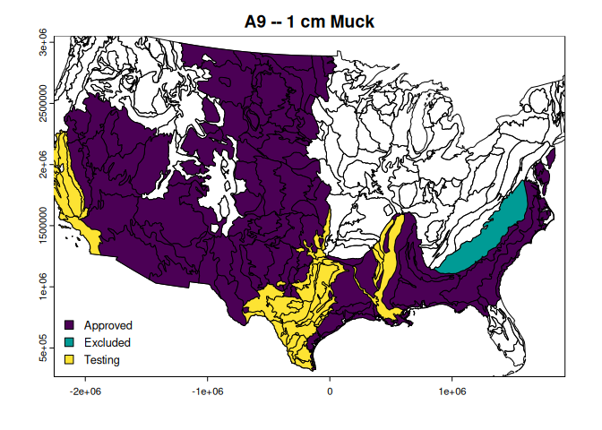

<!-- README.md is generated from README.Rmd. Please edit that file -->

# {hydricsoils}

<!-- badges: start -->

[](https://github.com/brownag/hydricsoils/actions/workflows/R-CMD-check.yaml)
[](https://humus.rocks/hydricsoils/)
<!-- badges: end -->

The goal of {hydricsoils} is to provide easy access to definitions,
criteria, and area of applicability for ‘[Field Indicators of Hydric
Soils in the United
States](https://humus.rocks/hydricsoils/articles/fihs.html)’ and also to
provide tools which assist in evaluating associated soil morphology.

## Installation

You can install the development version of {hydricsoils} like so:

``` r
if(!require("remotes")) install.packages("remotes")
remotes::install_github("brownag/hydricsoils")
```

## Examples

### Example 1

This basic example shows how to determine the area of applicability of
indicator “A9” (also known as “1 cm Muck”).

``` r
library(hydricsoils)
#> hydricsoils v0.1.2 -- using:
#>  - 'Field Indicators of Hydric Soils in the United States' v9.0 (2024)
#>  - 'Land Resource Regions and Major Land Resource Areas of the United States, the Caribbean, and the Pacific Basin' v5.2 (2022)

data(fihs, package = "hydricsoils")

subset(fihs, fihs$indicator == "A9", select = c("usage", "usage_symbols", "except_mlra"))
#>                                                                                            usage
#> 9 For use in LRRs D, F, G, H, P (except for MLRA 136), and T; for testing in LRRs C, I, J, and O
#>      usage_symbols except_mlra
#> 9 D, F, G, H, P, T         136
```

If we load the MLRA v5.2 database using `lrrmlra_geometry()` (requires
[{terra}](https://github.com/rspatial/terra/)) we can visualize the
extent of where the “A9” indicator is used.

There is a function in the package called `plot_indicator_usage()` which
simplifies the process of loading and subsetting the geometry. It
provides some simple defaults for visualizing areas where usage is
“Approved”, “Excluded” or in “Testing”.

``` r
plot_indicator_usage(
  "A9",
  test_areas = TRUE,
  ext = c("Approved", "Excluded"),
  crs = "EPSG:5070",
  plg = list(x = "bottomleft")
)
#> Loading required namespace: terra
```



### Example 2

Next let’s find all of the indicators that can be used in LRR “C” (also
known as the “California Subtropical Fruit, Truck, and Specialty Crop
Region”)

``` r
subset(fihs, fihs$indicator %in% usesym_to_indicator("C"),
       select = c("indicator", "indicator_name"))
#>    indicator              indicator_name
#> 1         A1          Histosol or Histel
#> 2         A2             Histic Epipedon
#> 3         A3                Black Histic
#> 4         A4            Hydrogen Sulfide
#> 5         A5           Stratified Layers
#> 11       A11 Depleted Below Dark Surface
#> 12       A12          Thick Dark Surface
#> 18       A18            Iron Monosulfide
#> 19        S1         Sandy Mucky Mineral
#> 22        S4         Sandy Gleyed Matrix
#> 23        S5                 Sandy Redox
#> 24        S6             Stripped Matrix
#> 30        F1         Loamy Mucky Mineral
#> 31        F2         Loamy Gleyed Matrix
#> 32        F3             Depleted Matrix
#> 33        F6          Redox Dark Surface
#> 34        F7       Depleted Dark Surface
#> 35        F8           Redox Depressions
```

Compare to LRR “D” (also known as the “Western Range and Irrigated
Region”)

``` r
subset(fihs, fihs$indicator %in% usesym_to_indicator("D"), 
       select = c("indicator", "indicator_name"))
#>    indicator              indicator_name
#> 1         A1          Histosol or Histel
#> 2         A2             Histic Epipedon
#> 3         A3                Black Histic
#> 4         A4            Hydrogen Sulfide
#> 9         A9                   1 cm Muck
#> 11       A11 Depleted Below Dark Surface
#> 12       A12          Thick Dark Surface
#> 18       A18            Iron Monosulfide
#> 19        S1         Sandy Mucky Mineral
#> 22        S4         Sandy Gleyed Matrix
#> 23        S5                 Sandy Redox
#> 24        S6             Stripped Matrix
#> 30        F1         Loamy Mucky Mineral
#> 31        F2         Loamy Gleyed Matrix
#> 32        F3             Depleted Matrix
#> 33        F6          Redox Dark Surface
#> 34        F7       Depleted Dark Surface
#> 35        F8           Redox Depressions
```

These outputs match the information we can find in the guide in Appendix
1.

It is important to remember that the area of applicability across Land
Resource Regions and Major Land Resource Areas can subtly differ.

The main difference between LRRs “C” and “D” is that indicator “A5” is
approved for use in LRR “C” whereas “A9” is approved for use in LRR “D”.
Note that while “A9” is available for testing in “C”, “A5” is not being
considered for use in LRR “D”.

We can visualize this by expanding the first example to include “A5” in
a separate pane. We limit the extent to just LRRs “C” and “D”.

``` r
x <- lrrmlra_geometry()
xext <- subset(x, x$LRRSYM %in% c("C", "D"))

par(mfrow = c(2, 1))
plot_indicator_usage(
  "A5",
  test_areas = TRUE,
  ext = xext,
  plg = list(x = "bottomleft")
)
plot_indicator_usage(
  "A9",
  test_areas = TRUE,
  ext = xext,
  plg = list(x = "bottomleft")
)
```


## Future work

In future updates I hope to include:

<!-- use :heavy_check_mark: and reference issue/PRs as these are completed -->

- \_ A defined *data.frame* format with standard column names, data
  types, and relationships that are needed to evaluate criteria for all
  established and provisional indicators

- \_ A glossary with definitions of key criteria and terms

- \_ An index to figures and pictures from the guide, and mapping of
  figures to specific indicators

- \_ Parsing of LRRs and MLRAs where provisional indicators are being
  tested

- \_ Routines for automatic evaluation of input data to determine which
  indicators may be met

- \_ Spatial methods for determining appropriate indicators to consider

- :heavy_check_mark: Helpers for creating graphics depicting where
  indicators are used or not (DONE: see `plot_indicator_usage()`)

## Disclaimer

The data and routines in this **R** package (hereafter the “Work”) are
not intended as a replacement for a thorough understanding of the latest
edition Field Indicators of Hydric Soils as distributed by official
sources.

This Work is released under the Creative Commons 1.0 Universal license.
In particular the Work is provided “as-is” and makes no representations
or warranties of any kind, express, implied, statutory or otherwise,
including without limitation warranties of title, merchantability,
fitness for a particular purpose, non infringement, or the absence of
latent or other defects, accuracy, or the present or absence of errors,
whether or not discoverable, all to the greatest extent permissible
under applicable law.

## References

United States Department of Agriculture, Natural Resources Conservation
Service. 2018. Field Indicators of Hydric Soils in the United States,
Version 8.2. L.M. Vasilas, G.W. Hurt, and J.F. Berkowitz (eds.). USDA,
NRCS, in cooperation with the National Technical Committee for Hydric
Soils. Available online:
<https://www.nrcs.usda.gov/resources/guides-and-instructions/field-indicators-of-hydric-soils>

United States Department of Agriculture, Natural Resources Conservation
Service. 2022. Land resource regions and major land resource areas of
the United States, the Caribbean, and the Pacific Basin. U.S. Department
of Agriculture, Agriculture Handbook 296. Available online:
<https://www.nrcs.usda.gov/resources/data-and-reports/major-land-resource-area-mlra>
